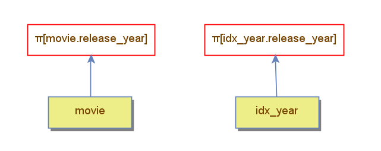

Para analisar a diferença do desempenho entre o table scan e o index scan no programa DBest, utilizou-se uma tabela de exemplo, composto pelos campos `movie_id`, `title` e `release_year` e criou-se os planos de execução A e B para aplicar um simples projeção sobre o atributo `release_year` dessa tabela. No plano A, a projeção foi aplicada sobre a tabela padrão, ao passo que no plano B, criou-se um índice composto pelo `movie_id` e pelo `release_year`, sendo esse último utilizado como chave.

Executando os planos de execução com o Comparator, obtemos as seguintes métricas:

| Métricas               | Plano A (Sem índice)      | Plano B (Com índice)     |
|------------------------|---------------------------|--------------------------|
| Tuples loaded          | 240                       | 240                      |
| Accessed blocks        | 12                        | 1                       |
| Loaded blocks          | 0                         | 0                        |
| Saved blocks           | 0                         | 0                        |
| Filter comparisons     | 0                         | 0                        |
| Memory Used            | 0                         | 0                        |
| Next Calls             | 480                       | 480                      |
| Primary key searches   | 0                         | 0                        |
| Records Read           | 240                       | 240                      |
| Sorted tuples          | 0                         | 0                        |

A partir da análise dos resultados, é possível observar que o plano B acessou somente 1 bloco para obter as mesmas informações do plano A. Isso ocorre porque, embora ambos os planos necessitem ler todas as tuplas da tabela com a operação `read_all`, o índice utilizado no plano B armazena apenas dois atributos númericos, guardando, consequentemente, uma quantidade maior de tuplas por bloco em comparação ao plano A, que contém, além dessas informações, a string para o atributo `title`. Desse modo, notou-se que utilizar o índice contribui para aumentar o desempenho da consulta.