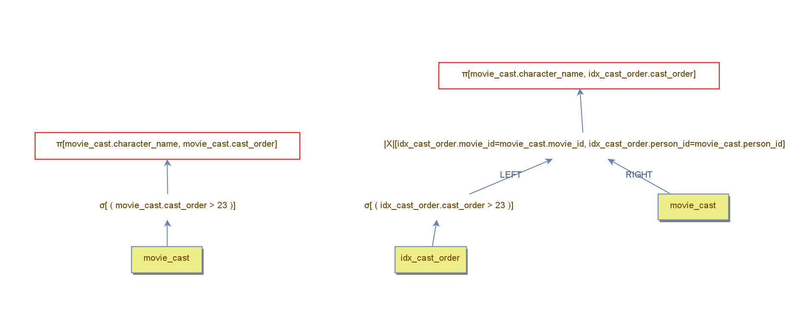

 Para analisar a diferença de desempenho entre a realização de um `table scan` e de um `index seek`, criou-se dois planos de execução com base na tabela `movie_cast`, assim como pode ser observado na figura abaixo. Tais planos de execução foram utilizados para encontrar o valor em que uma estratégia é melhor que a outra para o atributo `cast_order`.

 Inicialmente, testamos os planos de execução com o filtro para o `cast_order` como > 20 e > 25, concluindo que o ponto em que uma estratégia se torna melhor que a outra está nesse intervalo. Em seguida, utilizou-se o filtro como > 22, > 23 e > 24. Desse modo, foi possível encontrar que o `table_scan` lê menos blocos até o filtro 22 e, a partir do 23, o `index seek` apresenta um melhor desempenho. Isso ocorre, pois o `index_seek` precisa explorar os nós intermediários até chegar na folha correspondente, comportamento que pode necessitar de mais operações para chegar até o nó folha do que realizar um `table scan`. Além disso, a partir de uma certa quantidade de túplas, a realização da operação join se torna menos custosa, favorecendo o uso do índice.  

# > 20

| Métrica                  | index seek | table scan |
|--------------------------|----------------------------------------------|---------------------------------------------|
| Tuples loaded            | 236                                          | 236                                         |
| Accessed blocks          | 786                                          | 529                                         |
| Loaded blocks            | 0                                            | 0                                           |
| Saved blocks             | 0                                            | 0                                           |
| Filter comparisons       | 0                                            | 3179                                        |
| Memory Used              | 0                                            | 0                                           |
| Next Calls               | 1180                                         | 708                                         |
| Primary key searches     | 237                                          | 0                                           |
| Records Read             | 748                                          | 3179                                        |
| Sorted tuples            | 0                                            | 0                                           |

# > 22

| Métrica                | index seek | table scan |
|------------------------|-----------------------------------------------|----------------------------------------------|
| Tuples loaded          | 171                                           | 171                                          |
| Accessed blocks        | 569                                           | 529                                          |
| Loaded blocks          | 0                                             | 0                                            |
| Saved blocks           | 0                                             | 0                                            |
| Filter comparisons     | 0                                             | 3179                                         |
| Memory Used            | 0                                             | 0                                            |
| Next Calls             | 855                                           | 513                                          |
| Primary key searches   | 172                                           | 0                                            |
| Records Read           | 543                                           | 3179                                         |
| Sorted tuples          | 0                                             | 0                                            |

# > 23

| Métrica                   | index seek | table scan |
|--------------------------|--------------------------------------------------|--------------------------------------------------|
| Tuples loaded            | 150                                              | 150                                              |
| Accessed blocks          | 497                                              | 529                                              |
| Loaded blocks            | 0                                                | 0                                                |
| Saved blocks             | 0                                                | 0                                                |
| Filter comparisons       | 0                                                | 3179                                             |
| Memory Used              | 0                                                | 0                                                |
| Next Calls               | 750                                              | 450                                              |
| Primary key searches     | 151                                              | 0                                                |
| Records Read             | 471                                              | 3179                                             |
| Sorted tuples            | 0                                                | 0                                                |

# > 24

| Métrica                   | index seek | table scan |
|--------------------------|------------------------------------------|----------------------------------------|
| Tuples loaded            | 140                                      | 140                                    |
| Accessed blocks          | 464                                      | 529                                    |
| Loaded blocks            | 0                                        | 0                                      |
| Saved blocks             | 0                                        | 0                                      |
| Filter comparisons       | 0                                        | 3179                                   |
| Memory Used              | 0                                        | 0                                      |
| Next Calls               | 700                                      | 420                                    |
| Primary key searches     | 141                                      | 0                                      |
| Records Read             | 430                                      | 3179                                   |
| Sorted tuples            | 0                                        | 0                                      |

# > 25

| Métrica                   | index seek | table scan |
|--------------------------|----------------------------------------------------|----------------------------------------------------|
| Tuples loaded            | 122                                                | 122                                                |
| Accessed blocks          | 406                                                | 529                                                |
| Loaded blocks            | 0                                                  | 0                                                  |
| Saved blocks             | 0                                                  | 0                                                  |
| Filter comparisons       | 0                                                  | 3179                                               |
| Memory Used              | 0                                                  | 0                                                  |
| Next Calls               | 610                                                | 366                                                |
| Primary key searches     | 123                                                | 0                                                  |
| Records Read             | 384                                                | 3179                                               |
| Sorted tuples            | 0                                                  | 0                                                  |