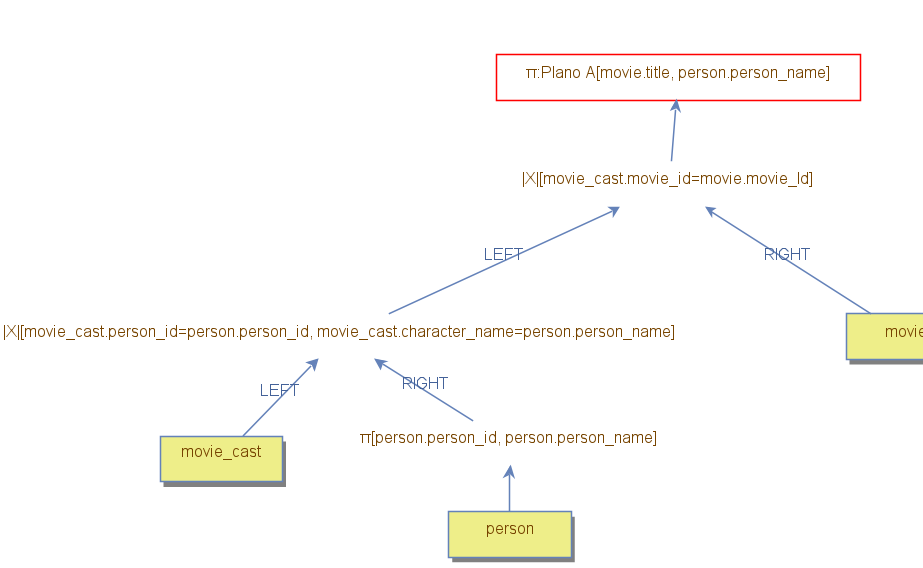
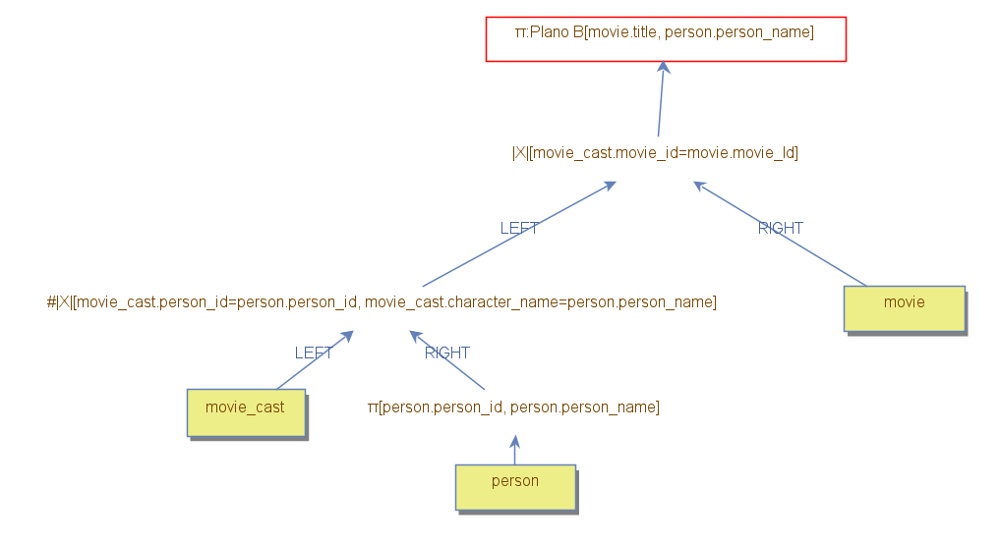

Para analisarmos a diferença de desempenho entre os tipos de junção, escrevemos dois planos A e B para retornar o título dos filmes em que um autor interpretou um personagem com seu nome, incluindo também seu nome no resultado. No plano A, como pode ser observado na Figura 1, utilizamos duas junções `Nested Loop Join`: uma para juntar a tabela `movie_cast` e `person`, selecionando os personagens que possuíam o mesmo nome de seu ator, e outra para juntar a filtragem anterior com a tabela `movie`, obtendo, assim, o nome do filme. No plano B, utilizamos o plano A como base e alteramos a junção da tabela `movie_cast` e `person` para utilizar o `Hash Join`, assim como exemplificado pela Figura 2.

*Figura 1: Plano A*

*Figura 2: Plano B*

É possível observar que o Plano B acessou cerca de 10 vezes menos blocos em comparação com o Plano A. Isso decorre em virtude do Plano A realizar uma busca na tabela `person` para cada registro da tabela `movie_cast`, enquanto que o Plano B lê uma única vez todos os registros da tabela `person`, por meio do `table_scan`, para criar uma estrutura hash na memória principal com os atributos `person_id` e `person_name`, realizando uma busca nessa estrutura em memória para cada registro de `movie_cast` ao invés de consultar o disco. Essa melhoria, no entanto, acarreta em um custo adicional de 325000 bytes de memória, o qual pode se tornar um empecilho em tabelas maiores.

|                             | Plano A         | Plano B         |
|-----------------------------|-----------------|-----------------|
| Tuples loaded               | 26              | 26              |
| Accessed blocks             | 7135            | 737             |
| Loaded blocks               | 0               | 0               |
| Saved blocks                | 0               | 0               |
| Filter comparisons          | 3179            | 0               |
| Memory Used                 | 0               | 325000          |
| Next Calls                  | 3309            | 13283           |
| Primary key searches        | 3205            | 26              |
| Records Read                | 9588            | 8231            |
| Sorted tuples               | 0               | 0               |