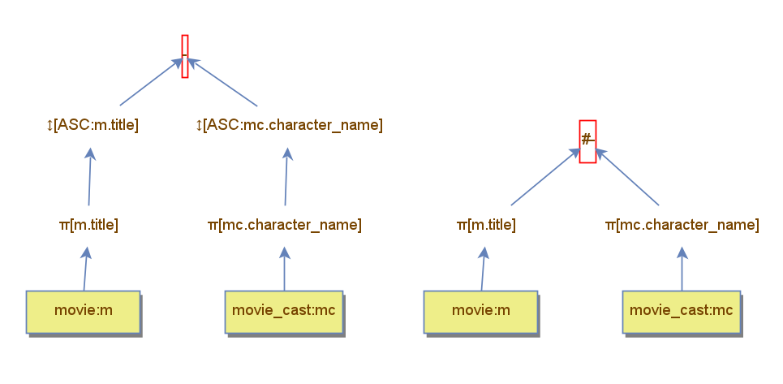

Os dois planos A e B, apresentados na figura abaixo, foram utilizados para comparar o desempenho entre o uso do operador de diferença padrão e do operador de diferença com hash. No plano A, as colunas individuais das duas tabelas são ordenadas antes de serem processadas pelo operador de diferença, ao passo que, no plano B, cria-se uma tabela hash para a coluna da tabela `movie_cast` e, para cada elemento da outra coluna da tabela de `movie`, ignora-o do resultado, caso ele for encontrado na tabela hash.

O desempenho de ambos é similar, uma vez que precisam ler as duas tabelas por completo para realizar a operação de diferença, fato que pode ser observado pela mesma quantidade de blocos lidos. No entanto, note que o plano B utiliza cerca de 5.4% de memória a menos em comparação com o plano A. Isso ocorre, pois o plano B mantém somente a tabela hash, construída da tabela `movie_cast`, na memória, enquanto que o plano A precisa manter as tuplas ordenadas de ambas as tabelas para realizar a diferença. Portanto, o plano B se mostra uma melhor opção em comparação com o plano A, devido a seu custo menor.

|                            | Difference | Hash Difference |
|----------------------------|---------|---------|
| Tuples loaded              | 227     | 227     |
| Accessed blocks            | 541     | 541     |
| Loaded blocks              | 0       | 0       |
| Saved blocks               | 0       | 0       |
| Filter comparisons         | 0       | 0       |
| Memory Used                | 127762  | 120802  |
| Next Calls                 | 10484   | 7065    |
| Primary key searches       | 0       | 0       |
| Records Read               | 3419    | 3419    |
| Sorted tuples              | 3419    | 0       |