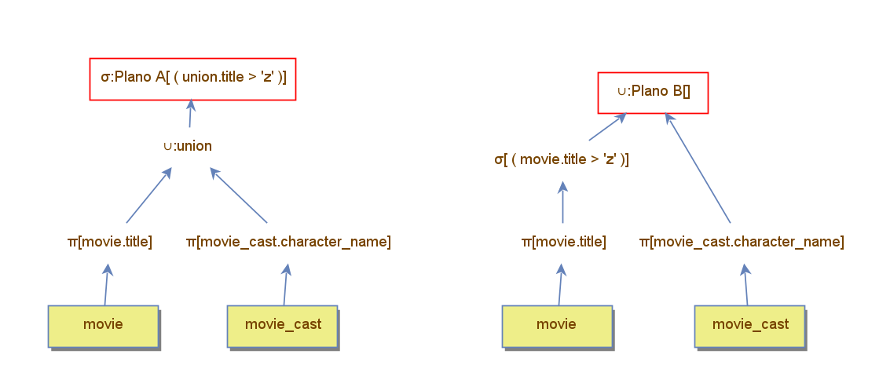

A diferença no comportamento de filtros em operações de união e interseção está diretamente ligada à forma como cada operação combina os dados.

Para ilustrar esse comportamento, foram criados dois planos de execução. No Plano A, o filtro foi aplicado após a operação de união. Já no Plano B, o filtro foi aplicado antes, diretamente sobre a tabela `movie`, antes da união ocorrer. Como resultado, o Plano B retornou mais registros, evidenciando o impacto da posição do filtro. 

|                          | Plano A | Plano B |
|--------------------------|---------|---------|
| Tuples loaded            | 3169    | 3185    |
| Accessed blocks          | 541     | 541     |
| Loaded blocks            | 0       | 0       |
| Saved blocks             | 0       | 0       |
| Filter comparisons       | 3419    | 240     |
| Memory Used              | 0       | 0       |
| Next Calls               | 13426   | 10029   |
| Primary key searches     | 0       | 0       |
| Records Read             | 3419    | 3419    |
| Sorted tuples            | 0       | 0       |

Na interseção, o resultado final contém apenas os registros que estão presentes nos dois lados da operação. Por isso, aplicar um filtro em apenas um dos lados já impacta o resultado, como se o filtro tivesse sido aplicado nos dois. Isso ocorre porque, para que um registro apareça na interseção, ele precisa satisfazer as condições de ambos os lados. Assim, é possível empurrar (ou "puxar") o filtro para apenas um lado da operação sem alterar a lógica do resultado.

Já na união, todos os registros de ambos os lados são combinados, sem que um lado influencie o outro. Se aplicarmos um filtro apenas em um dos lados, o outro continuará retornando todos os seus registros, o que pode resultar em um conjunto final maior do que se o filtro fosse aplicado após a união. Portanto, puxar o filtro para apenas um dos lados modifica o resultado, já que o outro lado da união não é afetado.

