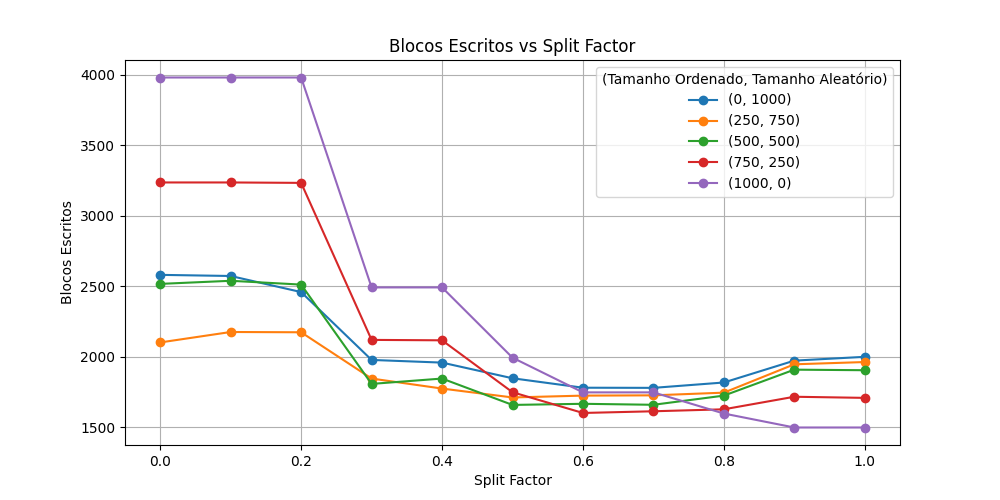
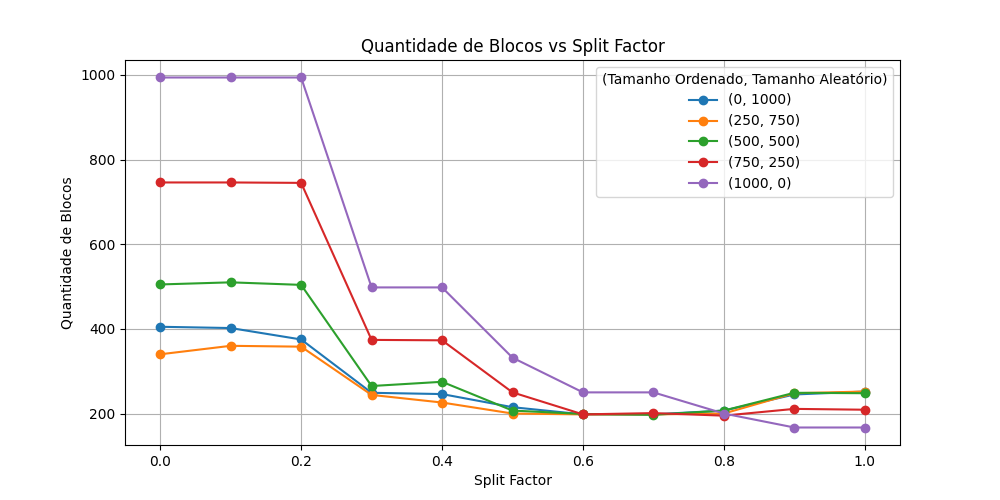

A análise do comportamento do split factor foi conduzida considerando diferentes cenários de teste, limitando o número de registros a 1000. Foram variadas as configurações do split factor entre 0.0 e 1.0 em incrementos de 0.1, bem como o número de registros ordenados entre 0 e 1000 em incrementos de 250. O restante dos registros foi considerado aleatório, sendo inserido após os dados ordenados. Os resultados foram analisados por meio de dois gráficos: um representando a quantidade total de blocos e outro a quantidade de blocos escritos.

Os resultados indicam que a eficácia do split factor está diretamente relacionada à distribuição dos dados. Para inserções predominantemente ordenadas, valores próximos de 1 para o split factor resultaram na redução tanto da quantidade total de blocos quanto do número de blocos escritos, demonstrando uma melhor eficiência no armazenamento. Em contrapartida, quando todos os dados eram aleatórios, os melhores desempenhos foram observados para split factors entre 0.5 e 0.7, sugerindo que espaços livres são necessários para acomodar a distribuição imprevisível dos dados.

Por fim, no cenário em que a maioria dos dados era ordenada, mas os registros finais eram aleatórios, um split factor em torno de 0.6 proporcionou a melhor performance. Isso indica que um equilíbrio entre espaços livres e eficiência na alocação de blocos é essencial para otimizar o armazenamento e a escrita de dados em diferentes contextos.