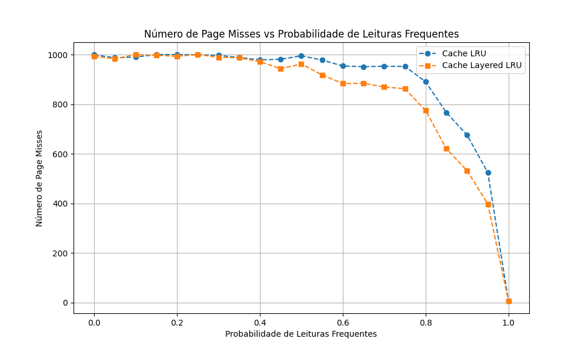

A análise comparativa entre a cache LRU padrão e a cache Layered LRU demonstrou diferenças significativas de desempenho dependendo da frequência de leituras repetidas, assim como pode ser observado no gráfico abaixo. O algoritmo LRU (Least Recently Used) tradicional gerencia a substituição de páginas removendo aquelas que não foram acessadas há mais tempo, garantindo que as páginas mais recentemente utilizadas permaneçam na memória. Já a abordagem Layered LRU introduz um sistema de camadas para diferenciar páginas acessadas apenas uma vez das páginas frequentemente reutilizadas.

Nos testes realizados, ambos os algoritmos tiveram desempenho similar até que a frequência de leituras repetidas atingisse 45%. Isso ocorre porque, nesse intervalo, a distribuição de acessos ainda não favorecia significativamente a diferenciação entre páginas descartáveis e páginas frequentemente utilizadas. A partir desse ponto, a cache Layered LRU passou a se destacar, reduzindo o número de page misses em aproximadamente 100 acessos em relação à LRU tradicional. Esse ganho se deve ao mid-point, um mecanismo central do algoritmo Layered LRU que separa páginas temporárias das que devem permanecer por mais tempo na cache.

A passagem de páginas entre camadas acontece quando uma página inicialmente classificada como de uso temporário é acessada novamente antes de ser removida, promovendo-a para a camada de longo prazo. Esse mecanismo melhora a eficiência ao evitar a substituição prematura de páginas úteis. Quando a frequência de leituras repetidas chegou a 100%, ambos os caches convergiram para o mesmo desempenho, pois todas as páginas acessadas eram reutilizadas constantemente, tornando desnecessária a diferenciação entre acessos únicos e frequentes.

Dessa forma, os testes confirmaram que a Layered LRU é mais eficiente em cenários com um volume significativo de leituras frequentes, enquanto seu desempenho se equipara à LRU padrão quando os acessos são majoritariamente aleatórios ou totalmente previsíveis.
